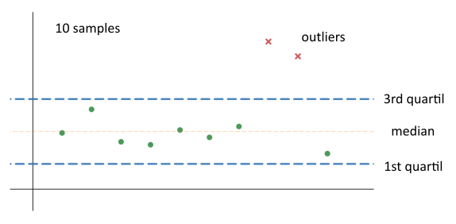
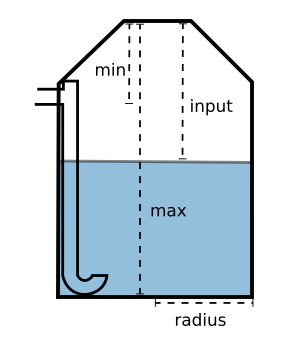

# node-red-contrib-cistern

This package contains node-red nodes for usage with *cisterns*.
Best for usage with an ultrasound module like the HC-SR04. 

## Node - Outlier
A node that removes/gets outliers of incoming values, specified by **numberOfSamples** or directly by an array.

#### Input mode
- Batch - samples:
Evaluates input once the amount of input values are equal to the given **numberOfSamples**.
Afterwards the node awaits again **numberOfSamples** or an array.

- Array: Evaluates the incoming array and ignores **numberOfSamples**.

#### Outlier mode
 Outliers are values outside of 1.5 times the interquartile range. [https://mathworld.wolfram.com/Outlier.html](https://mathworld.wolfram.com/Outlier.html))

- Remove: Outliers are removed and not passed on.
- Get: Outliers only are passed on.

#### Output mode
- Median: Median value of the remaining values is given as output
- Array: The filtered values are passed on.

## Node - Cistern
A node for easy calculation of liters and percentage in a cylindrical cistern.

- Input: measured distance from top to water level.
- maxDistance: distance from top to bottom of the cistern.
- minDistance: distance from top to max water level.

